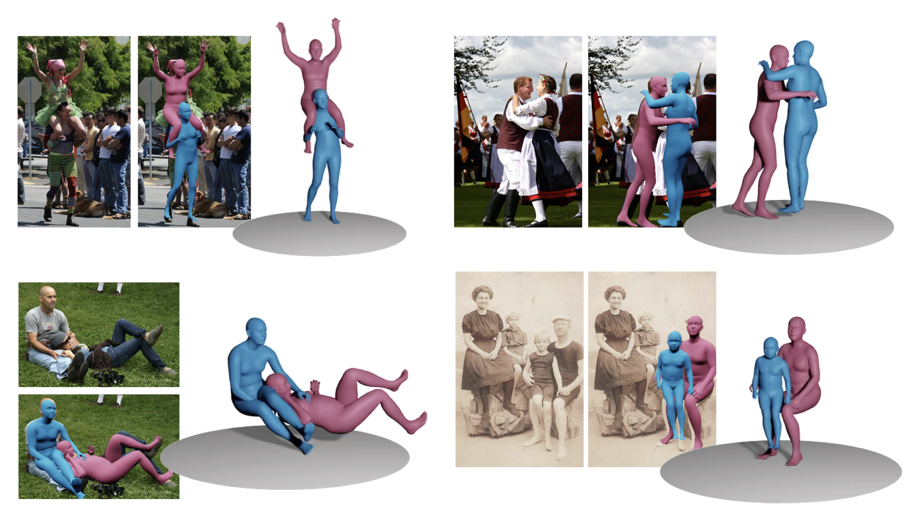

# BUDDI
<b> Generative Proxemics: A Prior for 3D Social Interaction from Images </b>\
[[Project Page](https://muelea.github.io/buddi/)] [[arXiv](https://arxiv.org/abs/2306.09337)]

https://github.com/muelea/buddi/assets/13314980/b0de0db7-e24f-4c74-8f4d-5029b7d320a2

## In this repo you will find ...

... [BUDDI](#unconditional-sampling), a diffusion model that learned the joint distribution of two people in close proxeminty -- thus a a <b>BUD</b>dies <b>DI</b>ffusion model. BUDDI directly generates [SMPL-X](https://smpl-x.is.tue.mpg.de) body model parameters for two people.

... [Optimization with BUDDI](#optimization-with-buddi), we use BUDDI as a prior during optimization via an SDS loss inspired by [DreamFusion](https://arxiv.org/pdf/2209.14988.pdf). This approach does not require ground-truth contact annotations.

... [Flickr Fits](#flickr-fits), we create SMPL-X fits for [FlickrCI3D](https://ci3d.imar.ro) via an optimization method that takes ground-truth contact annotations between two people into account.

## NEWS!!
We have a new version of BUDDI with BEV conditioning. This repo is still for the old version of BUDDI. Code updates will follow and be announced here.

## Release status

| BUDDI inference | BUDDI training | Optimization with BUDDI | Flickr Fits |
| :----: | :----: | :----: | :----: |
| &check; | &check;  | &check; | &#x2717; |


## Installation
Please see [Installation](./documentation/INSTALL.md) for details. 

## Datasets
Please see [Dataset](./documentation/DATA.md) for details.

## Demo 

### Unconditional sampling


Unconditional generation stating from random noise using different sampling schedules

```
# linear schedule starting from max-t and skipping every skip-steps step. Here, it's 1000 990 980 ... 20 10. 
python llib/methods/hhc_diffusion/evaluation/sample.py --exp-cfg essentials/buddi/buddi_unconditional.yaml --output-folder demo/diffusion/samples/ --checkpoint-name essentials/buddi/buddi_unconditional.pt --max-images-render=100 --num-samples 100 --max-t 1000 --skip-steps 10 --log-steps=100 --save-vis 
```


### Optimization with BUDDI



Run optimization using BUDDI as prior. This script will find all OpenPose Bounding boxes on a photo and run Optimization with BUDDI for all pairs of people who overlap on the picture.
```
python llib/methods/hhcs_optimization/main.py --exp-cfg llib/methods/hhcs_optimization/configs/buddi_cond_bev_demo.yaml --exp-opts logging.base_folder=demo/optimization/buddi_cond_bev_demo datasets.train_names=['demo'] datasets.train_composition=[1.0] datasets.demo.original_data_folder=demo/data/FlickrCI3D_Signatures/demo datasets.demo.image_folder=images model.optimization.pretrained_diffusion_model_ckpt=essentials/buddi/buddi_cond_bev.pt model.optimization.pretrained_diffusion_model_cfg=essentials/buddi/buddi_cond_bev.yaml logging.run=fit_buddi_cond_bev_flickrci3ds
```

Run optimization with BUDDI on FlickrCI3D. First follow the data and isntall instructions, then run the commands below. You can use --cluster_pid and --cluster_bs flags to process only a few images or distribute batches of data on a cluster.
```
# run optimization for training split
python llib/methods/hhcs_optimization/main.py --exp-cfg llib/methods/hhcs_optimization/configs/buddi_cond_bev.yaml --exp-opts logging.base_folder=demo/optimization/buddi_cond_bev logging.run=fit_buddi_cond_bev_flickrci3ds datasets.train_names=['flickrci3ds'] datasets.train_composition=[1.0] datasets.val_names=[] datasets.test_names=[] model.optimization.pretrained_diffusion_model_ckpt=essentials/buddi/buddi_cond_bev.pt model.optimization.pretrained_diffusion_model_cfg=essentials/buddi/buddi_cond_bev.yaml

# to run optimization on the validation split set
datasets.train_names=[] datasets.train_composition=[] datasets.val_names=['flickrci3ds'] datasets.test_names=[]

# to run optimization on the test split set
datasets.train_names=[] datasets.train_composition=[] datasets.val_names=[] datasets.test_names=['flickrci3ds']
```

## Training

### Flickr Fits

To create training data, we fit SMPL-X to images from [FlickrCI3D Signatures](https://ci3d.imar.ro/flickrci3d) via an optimization method that takes ground-truth contact annotations between two people on the human body into account. First follow the data and install instructions, then run the commands below. You can use --cluster_pid and --cluster_bs flags to process only a few images or distribute batches of data on a cluster.
```
# run optimization on FlickrCI3D Signatures training split
python llib/methods/hhcs_optimization/main.py --exp-cfg llib/methods/hhcs_optimization/configs/flickr_fits.yaml --exp-opts logging.base_folder=demo/optimization logging.run=flickr_fits datasets.train_names=['flickrci3ds'] datasets.train_composition=[1.0] datasets.val_names=[] datasets.test_names=[]

# to run optimization on the validation split set
datasets.train_names=[] datasets.train_composition=[] datasets.val_names=['flickrci3ds'] datasets.test_names=[]

# to run optimization on the test split set
datasets.train_names=[] datasets.train_composition=[] datasets.val_names=[] datasets.test_names=['flickrci3ds']
```

### BUDDI Training
Follow the data download and processing steps in [Dataset](./documentation/DATA.md). Then run: 
```
# conditional model
python llib/methods/hhc_diffusion/main.py --exp-cfg llib/methods/hhc_diffusion/configs/config_buddi_v02_cond_bev.yaml --exp-opts logging.base_folder=demo/diffusion/training logging.run=buddi_cond_bev datasets.augmentation.use=True model.regressor.losses.pseudogt_v2v.weight=[1000.0] logging.logger='tensorboard'

# unconditional model 
python llib/methods/hhc_diffusion/main.py --exp-cfg llib/methods/hhc_diffusion/configs/config_buddi_v02.yaml --exp-opts logging.base_folder=demo/diffusion/training logging.run=buddi datasets.augmentation.use=True datasets.chi3d.load_unit_glob_and_transl=True datasets.hi4d.load_unit_glob_and_transl=True model.regressor.losses.pseudogt_v2v.weight=[100.0] logging.logger='tensorboard'
```


## Evaluation 

To compare generated meshes against the training data on SMPL-X parameter FID you can use the evaluation script. To generate a x_starts_smplx.pkl file, see [here](#unconditional-sampling).
```
python llib/methods/hhc_diffusion/evaluation/eval.py --exp-cfg llib/methods/hhc_diffusion/evaluation/config_eval.yaml --buddi demo/diffusion/samples/generate_1000_10_v0/x_starts_smplx.pkl --load-training-data
```

We evaluate BUDDI against pseudo-ground truth fits and ground-truth contact labels of FlickrCI3D.
```
python llib/methods/hhcs_optimization/evaluation/flickrci3ds_eval.py --exp-cfg llib/methods/hhcs_optimization/evaluation/flickrci3ds_eval.yaml -gt <base_folder>/fit_pseudogt_flickrci3ds_test -p <base_folder>/<run_folder> --flickrci3ds-split test

python llib/methods/hhcs_optimization/evaluation/chi3d_eval.py --exp-cfg llib/methods/hhcs_optimization/evaluation/chi3d_eval.yaml --predictions-folder <base_folder>/<run_folder> --eval-split test

python llib/methods/hhcs_optimization/evaluation/hi4d_eval.py --exp-cfg llib/methods/hhcs_optimization/evaluation/hi4d_eval.yaml --predictions-folder <base_folder>/<run_folder> --eval-split test
```


## Acknowledgments
We thank our colleagues for their feedback, in particular, we thank Aleksander Holynski, Ethan Weber, and Frederik Warburg for their discussions about diffusion and the SDS loss, Jathushan Rajasegaran, Karttikeya Mangalam and Nikos Athanasiou for their discussion about transformers, and Alpar Cseke, Taylor McConnell and Tsvetelina Alexiadis for running the user study.

Previous work on human pose and shape estimation has made this project possible: we use [BEV](https://github.com/Arthur151/ROMP) to initialize the optimization method, the Flickr and mocap data provided in [Close interactions 3D](https://ci3d.imar.ro/index.php/). We also use previous workon diffusion models and their code bases, [diffusion](https://github.com/hojonathanho/diffusion) and [guided-diffusion](https://github.com/openai/guided-diffusion/tree/main/guided_diffusion).


## Citation
```
@article{mueller2023buddi,
    title={Generative Proxemics: A Prior for {3D} Social Interaction from Images},
    author={M{\“u}ller, Lea and Ye, Vickie and Pavlakos, Georgios and Black, Michael J. and Kanazawa, Angjoo},
    journal={arXiv preprint 2306.09337v2},
    year={2023}}
```

## License
See [License](./LICENSE).


## Disclosure
MJB has received research gift funds from Adobe, Intel, Nvidia, Meta/Facebook, and Amazon. MJB has financial interests in Amazon, Datagen Technologies, and Meshcapade GmbH. While MJB is a part-time employee of Meshcapade, his research was performed solely at, and funded solely by, the Max Planck Society.


## Contact
Please contact lea.mueller@tuebingen.mpg.de for technical questions.
